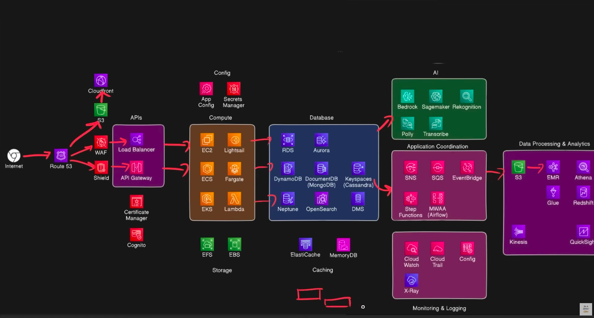

# AWS Learning Journey ☁️

A comprehensive, hands-on study of **Amazon Web Services (AWS)** — the world's leading cloud computing platform offering 200+ pay-as-you-go services across compute, storage, databases, networking, AI/ML, and more.

> **Note:** Detailed, step-by-step notes with real-world examples (Amazon-style use cases), setup guides, CLI commands, pricing comparisons, and analogies are available in [`notes.md`](./notes.md).



---

## 📚 Topics Covered

### 🌐 Networking & Content Delivery
| Service | What it does |
|---|---|
| **Route 53** | DNS service — domain registration, routing (A, CNAME, MX, NS records), health checks |
| **CloudFront** | CDN — serves content from 600+ edge locations worldwide with caching, SSL, DDoS protection |
| **ELB (Load Balancer)** | Distributes traffic across servers — ALB (L7), NLB (L4), GWLB (IP) |

### 🛡️ Security, Identity & Compliance
| Service | What it does |
|---|---|
| **IAM** | Access control via policies, users, roles |
| **AWS WAF** | Application-layer firewall — SQL injection, XSS, bad bots, rate limiting |
| **AWS Shield** | DDoS protection |
| **ACM (Certificate Manager)** | SSL/TLS certificate issuance & management |
| **Cognito** | Authentication — User Pools (sign-up/sign-in) & Identity Pools (federated access) |
| **Secrets Manager** | Secure storage & rotation of credentials |

### ☁️ Compute
| Service | What it does |
|---|---|
| **EC2** | Virtual servers — instance types, pricing models (On-Demand, Reserved, Spot) |
| **Lightsail** | Simplified, fixed-price VPS for small apps & blogs |
| **ECS** | Container orchestration (Docker) — tasks, services, clusters |
| **Fargate** | Serverless compute for containers — no server management |
| **EKS** | Managed Kubernetes for multi-cloud, complex deployments |
| **Lambda** | Serverless, event-driven compute — pay per millisecond, max 15 min |

### 📁 Storage
| Service | What it does |
|---|---|
| **S3** | Object storage — 11 nines durability, lifecycle policies, storage classes, static website hosting, presigned URLs |
| **EBS** | Block-level volumes attached to EC2 (local hard drive) |
| **EFS** | Scalable elastic file system for shared file storage |

### 🗄️ Databases
| Service | What it does |
|---|---|
| **RDS** | Managed relational databases (MySQL, PostgreSQL, etc.) |
| **Aurora** | High-performance, MySQL/PostgreSQL-compatible engine |
| **DynamoDB** | NoSQL, fully managed, serverless key-value database |
| **DocumentDB** | MongoDB-compatible document database |
| **Keyspaces** | Cassandra-compatible managed database |
| **Neptune** | Managed graph database |
| **OpenSearch** | Search & analytics (Elasticsearch-compatible) |
| **DMS** | Database migration service |
| **ElastiCache** | In-memory caching (Redis/Memcached) |
| **MemoryDB** | Durable, Redis-compatible in-memory database |
| **EMR** | Managed big data processing — Hadoop/Spark clusters on EC2 |
| **Athena** | Serverless SQL queries directly on S3 data — pay per query |
| **Glue** | Serverless ETL — crawlers, Data Catalog, PySpark jobs |
| **Redshift** | Petabyte-scale data warehouse — fast columnar SQL analytics |
| **QuickSight** | Cloud BI — interactive dashboards & reports (Athena/Redshift native) |
| **Kinesis** | Real-time data streaming — Data Streams, Firehose, Analytics |
| **CloudWatch** | Monitoring & observability — metrics, alarms, logs, dashboards |
| **CloudTrail** | Audit logging — records every API call for security & compliance |
| **Config** | Resource configuration tracking & compliance rules |
| **X-Ray** | Distributed tracing — debug requests across microservices |
| **CodeBuild** | Managed CI/CD build & test service (part of CodeSuite) |
| **CodeDeploy** | Automated deployments — EC2, Lambda, ECS (blue/green, rolling) |
| **CodePipeline** | CI/CD orchestration — source/build/test/deploy pipeline stages |
| **CloudFormation** | Infrastructure as Code — infrastructure via YAML/JSON templates |
| **CDK** | Infrastructure as Code in real languages (Python/TS) → CloudFormation |
| **Amplify** | Full-stack dev platform — backend + hosting + CI/CD for web/mobile apps |

### 🤖 AI / Machine Learning
| Service | What it does |
|---|---|
| **Bedrock** | Foundational models via API (FMs) |
| **SageMaker** | Build, train & deploy ML models |
| **Rekognition** | Image & video analysis |
| **Polly** | Text-to-speech |
| **Transcribe** | Speech-to-text |

### 🔄 Application Integration & Messaging
| Service | What it does |
|---|---|
| **API Gateway** | Create, publish & secure REST/WebSocket APIs (serverless) |
| **SNS (Simple Notification Service)** | Pub/sub message delivery (email, SMS, push) |
| **SQS (Simple Queue Service)** | Decoupled message queues for async processing |
| **EventBridge** | Event-driven routing between AWS services |
| **Step Functions** | Visual workflow orchestration |
| **MWAA** | Managed Apache Airflow — ETL/data pipeline orchestration via Python DAGs |

### ⚙️ Configuration & Management
| Service | What it does |
|---|---|
| **AppConfig** | Application configuration management with validation |

---

## 🧠 Key Concepts & Skills Acquired

- **DNS resolution** — Route 53 records, hosted zones, name server delegation
- **Object storage** — S3 buckets, versioning, bucket policies, access control, presigned URLs
- **CDN & caching** — CloudFront edge locations, TTL, geo-restriction, Lambda@Edge
- **Load balancing & scaling** — ALB vs NLB, target groups, health checks
- **Serverless architecture** — API Gateway + Lambda + DynamoDB end-to-end patterns
- **Containerization** — Docker images, ECS vs EKS vs Fargate trade-offs
- **Security** — WAF rules, Shield, SSL via ACM, Cognito auth, Secrets Manager
- **Data & messaging** — Choosing the right database, SQS vs SNS vs EventBridge
- **Cost optimization** — Sompare pricing models (On-Demand vs Reserved vs Spot, Lambda pay-per-use, S3 lifecycle)
- **AWS CLI** — `aws s3`, `aws s3 presign`, `aws s3api` commands
- **Common pitfalls** — S3 Access Denied (access denied → presigned URLs), API Gateway timeouts (29s), Lambda cold starts

---

## 🛠️ Tech Stack Explored

| Domain | Tools |
|---|---|
| **CLI** | AWS CLI (`aws configure`, `aws s3`, `aws s3api`) |
| **Infrastructure** | Console-based setup workflows |
| **Runtimes** | Node.js, Python (Lambda) |
| **Containers** | Docker, ECR |

---

## 📁 Repository Structure

```
.
├── README.md      # Overview of the AWS learning journey
└── notes.md       # Detailed, topic-wise study notes (2,500+ lines)
```

---

## 🚀 Next Steps

- [ ] Build a full serverless project (API Gateway + Lambda + DynamoDB)
- [ ] Deploy a static site on S3 behind CloudFront with WAF
- [ ] Set up CI/CD with CodePipeline & CodeBuild
- [ ] Explore Infrastructure as Code (Terraform / CloudFormation)
- [ ] Prepare for **AWS Cloud Practitioner** or **AWS Solutions Architect** certification

---

*Created as part of a self-paced, hands-on AWS learning journey.*# aws-learning
